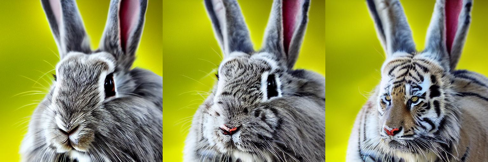
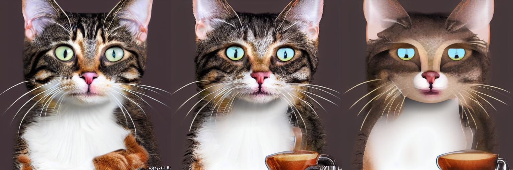
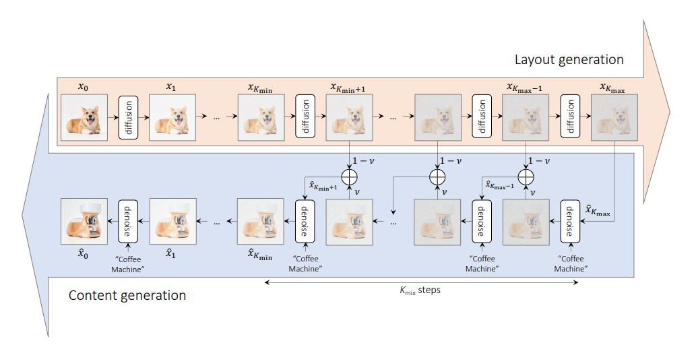

# MagicMix with Stable Diffusion

<!-- #region -->
<p align="center">

</p>
<!-- #endregion -->

<!-- #region -->
<p align="center">

</p>
<!-- #endregion -->

> Output from this repo's implementation of MagicMix.
> Original Image, $\nu$ = 0.75, $\nu$ = 0.9 respectively.

Implementation of MagicMix with Stable Diffusion (https://arxiv.org/abs/2210.16056) in PyTorch. _This is unofficial Implementation_.

# Installation

```bash
pip install git+https://github.com/cloneofsimo/magicmix.git
```

To get it to work with CUDA GPU, install necessary pytorch and cuda versions.

# Explanations

There are three main parameters for MagicMix. $K_{min} = k_{min ratio} T$, $K_{max} = k_{max ratio} T$, and $\nu$. $T$ is the number of sampling steps for the scheduler.



Basically, $\nu$ determines _how little layout image_ (in the photo above, the corgi) is going to effect the diffusion process. Greater the $\nu$, greater the content is going to effect.

$k_{min ratio}$ and $k_{max ratio}$ determines the range of the mixing process. If $K_{max}$ is large, this will have the same effect as loosing much info of the original layout image. If $K_{min}$ is large, this will have the effect of letting content semantic to have effect more freely.

# Basic Usage

In the package `magic_mix`, you can find the implementation of MagicMix with Stable Diffusion.
Before running, fill in the variable `HF_TOKEN` in `.env` file with Huggingface token for Stable Diffusion, and load_dotenv().

```python
from magic_mix import magic_mix_single_image

load_dotenv(verbose=True)
image = Image.open(input_image_path).convert("RGB")

mixed_sementics = magic_mix_single_image(
    layout_image=image,
    num_inference_steps=50,
    content_semantics_prompts=["coffee machine", "tiger"],
    k_min=20,
    k_max=30,
    nu=0.5,
    guidance_scale_at_mix=7.5,
    seed=0,
    device="cuda:0"
) # mixed sementics is PIL image files...

image[0].save("mixed_sementics.png")

```

Or simply run the following command to generate mixed images.

```bash
python scripts/run_text_image_mix.py \
    --input_image ./examples/inputs/1.jpg \
    --output_dir ./examples/outputs \
    --num_inference_steps 50 \
    --content_semantics_prompts "coffee machine" "tiger" \
    --k_min_ratio 0.3 \
    --k_max_ratio 0.6 \
    --nu 0.5 \
    --guidance_scale_at_mix 7.5 \
    --seed 0
```
